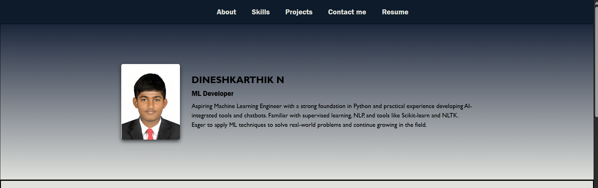
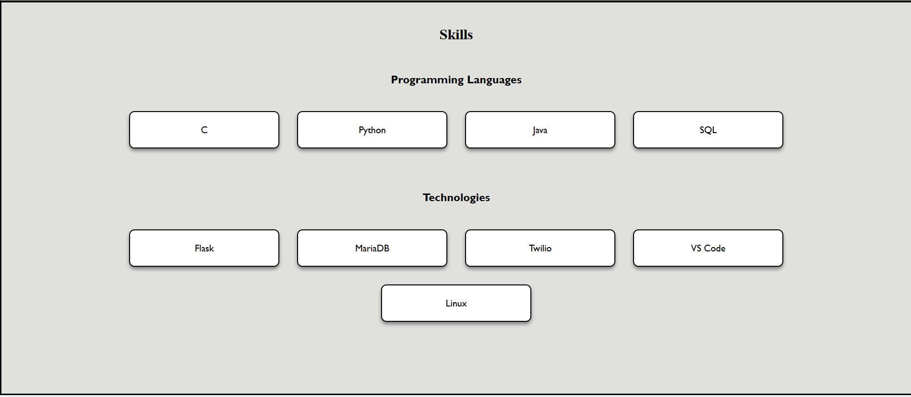
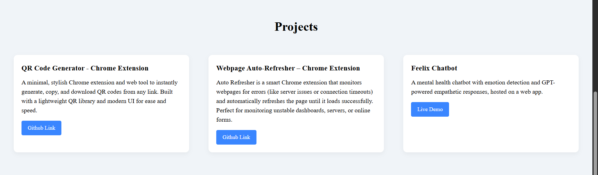
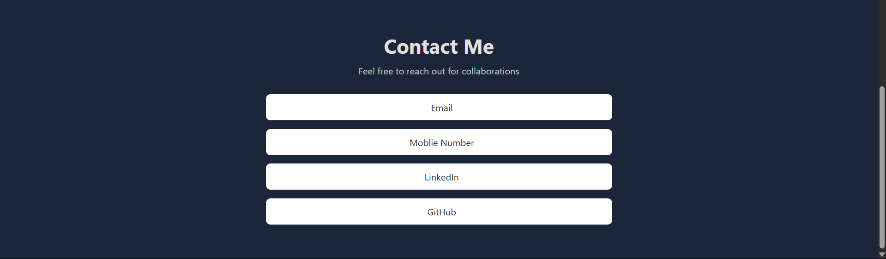

# Ex01 Portfolio
## Date: 11-08-2025

## AIM
To create a Portfolio using HTML and CSS.

## ALGORITHM
### STEP 1
Create an HTML file (index.html)

### STEP 2
Create a CSS file (style.css)

### STEP 3
Include a navigation bar with links to different sections.

### STEP 4
Add structured sections for introduction, about, projects, and contact details.

### STEP 5
Define global styles for fonts, colors, and layout.

### STEP 6
Style the header, navigation bar, and sections.

### STEP 7
Use Flexbox or CSS Grid for layout design.

### STEP 8
Add hover effects and transitions for interactivity.

### STEP 9
Add Images and Media.

### STEP 10
Use optimized images for a professional look.

### STEP 11
Open the HTML file in a browser to check layout and functionality.

### STEP 12
Fix styling issues and refine content placement.

### STEP 13
Deploy the Portfolio.

### STEP 14
Upload to GitHub Pages for free hosting.

## PROGRAM

### main.html

```
<!DOCTYPE html>
<html lang="en">
<head>
    <meta charset="UTF-8">
    <meta name="viewport" content="width=device-width, initial-scale=1.0">
    <title>Portfolio</title>
    <link rel="stylesheet" href="styles.css">
</head>
<body>
    <header>
        
        <nav>
            <ul>
                <li><a href="#About">About</a></li>
                <li><a href="#skill">Skills</a></li>
                <li><a href="#projects">Projects</a></li>
                <li><a href="#contact">Contact me</a></li>
                <li><a download href="https://drive.usercontent.google.com/download?id=1028aUtySrY5Eb-VgKwY7rakVkO225mwo&export=download&authuser=0&confirm=t&uuid=92f85feb-bcdb-4066-80f5-2a2602befc3a&at=AN8xHophwsChBaDPsYNzB4Zk70tX:1754850061410">Resume</a></li>
            </ul>
        </nav>
    </header>
    <section id="About" class="home">
        <div  class="home-content">
            
            <div class="home-names">
                <h1>DINESHKARTHIK N</h1>
                <h4>ML Developer</h4>
                <p>Aspiring Machine Learning Engineer with a strong foundation in Python and practical experience developing
AI-integrated tools and chatbots. Familiar with supervised learning, NLP, and tools like Scikit-learn and NLTK. Eager to
apply ML techniques to solve real-world problems and continue growing in the field.</p>
            </div>
        </div>
    </section>

    <section id="skill" class="skills">
        <h2>Skills</h2>
        <div class="skills-content">
            <div class="skill-box">
            <h3>Programming Languages</h3>
            <ul class="skill-list">
                <li class="skill-item">C</li>
                <li class="skill-item">Python</li>
                <li class="skill-item">Java</li>
                <li class="skill-item">SQL</li>
            </ul>
            </div>
            <div class="skill-box">
            <h3>Technologies</h3>
            <ul class="skill-list">
                <li class="skill-item">Flask</li>
                <li class="skill-item">MariaDB</li>
                <li class="skill-item">Twilio</li>
                <li class="skill-item">VS Code</li>
                <li class="skill-item">Linux</li>
            </ul>
            </div>
        </div>
    </section>

  <section id="projects">
  <h2>Projects</h2>
  <div class="projects-container">

    <div class="project-card">
      <h3> QR Code Generator - Chrome Extension</h3>
      <p>A minimal, stylish Chrome extension and web tool to instantly generate, copy, and download QR codes from any link. Built with a lightweight QR library and modern UI for ease and speed.</p>
      <a rel="noopener" href="https://github.com/dinesh2068/QR-Generator" class="btn-live" target="_blank">Github Link</a>
    </div>

    <div class="project-card">
      <h3>Webpage Auto-Refresher – Chrome Extension</h3>
      <p>Auto Refresher is a smart Chrome extension that monitors webpages for errors (like server issues or connection timeouts) and automatically refreshes the page until it loads successfully. Perfect for monitoring unstable dashboards, servers, or online forms.</p>
      <a rel="noopener" href="https://github.com/dinesh2068/WebPage_Auto_Refresher" class="btn-live" target="_blank">Github Link</a>
    </div>

    <div class="project-card">
      <h3>Feelix Chatbot</h3>
      <p>A mental health chatbot with emotion detection and GPT-powered empathetic responses, hosted on a web app.</p>
      <a rel="noopener" href="https://cdn.botpress.cloud/webchat/v3.0/shareable.html?configUrl=https://files.bpcontent.cloud/2025/04/08/10/20250408101600-IIKXU5B6.json" class="btn-live" target="_blank">Live Demo</a>
    </div>
  </div>
</section>

<section id="contact">
    <div class="contact-container">
        <h2>Contact Me</h2>
        <p>Feel free to reach out for collaborations </p>
        
        <div class="contact-info">
            <a href="mailto:baladinesh2068@gmail.com" target="_blank">
                <i class="fas fa-envelope"></i> Email
            </a>
            <a href="tel:+6379731223">
                <i class="fas fa-phone-alt"></i> Moblie Number
            </a>
            <a rel="noopener" href="https://www.linkedin.com/in/dineshkarthik-n/" target="_blank">
                <i class="fab fa-linkedin"></i> LinkedIn
            </a>
            <a rel="noopener" href="https://github.com/dinesh2068" target="_blank">
                <i class="fab fa-github"></i> GitHub
            </a>
        </div>
    </div>
</section>

</body>
</html>

```

### styles.css

```

*{  
    margin: 0;
    border: 0;
    box-sizing: border-box;
}

header{
    background: #0d1b2a; 
    padding: 20px;
    color: #e0e1dd;
}

nav ul{
    list-style-type: none;
    margin:0;
    display: flex;
    justify-content: center;
}
nav li{
    margin-left: 40px;
}
nav li a{
    text-decoration: none;
    color: #e0e1dd;
    font-size: larger;
    font-family: 'Franklin Gothic Medium', 'Arial Narrow', Arial, sans-serif;
}
nav li a:hover{
    color: #3a86ff; 
    text-decoration:none;
}

.body{
    color:#000000;
}

.home{
    background: linear-gradient(#1b263b, #e0e1dd); 
    color: #000000;
    text-align: left;
    padding: 40px 50px;
    border:1px solid black;
    min-height: 400px;
    display: flex;
    justify-content: center;
    align-items: center;
}
.home-names h4 {
    margin: 0 0 0px 0;
    font-weight: bold;
    font-family: 'Franklin Gothic Medium', 'Arial Narrow', Arial, sans-serif;
}

.home-names p{
    line-height: 1.5;
    font-weight: 200;
    font-family: 'Gill Sans', 'Gill Sans MT', Calibri, 'Trebuchet MS', sans-serif;
}

.home-photo{
    width: 150px;
    border-radius: 3%;
    box-shadow: 0 4px 10px rgba(0,0,0,.7);
}

.home h1{
    font-family: 'Gill Sans', 'Gill Sans MT', Calibri, 'Trebuchet MS', sans-serif;
    margin:0 0 0px 0;
}
.home h4{
    font-size:large;
}
.home-names{
    flex: 1;
    text-align: left;
    display: flex;
    flex-direction: column;
    gap:10px;
}

.home-names p{
    margin: 0;
}

.home-content{
    display: flex;
    align-items:center; gap: 30px;
    flex-wrap: wrap;
    max-width: 900px;
    margin: auto;
}

.skills {
    padding: 40px;
    text-align: center;
    border: solid black;
    background: #e0e1dd; 
}

.skill-box{
    display: flex;
    justify-content: center;
    flex-direction: column;
    align-items: center;
    padding: 20px;
    font-family: 'Gill Sans', 'Gill Sans MT', Calibri, 'Trebuchet MS', sans-serif;
}

.skill-box h3{
    margin-bottom: 13px;
}

.skill-box ul{
    padding: 30px;
}

.skills-content{
    margin: 30px 0;
    gap: 60px;
}

.skill-list{
    border: auto;
    display: flex;
    justify-content: center;
    flex-wrap: wrap;
    gap: 30px;
    padding: 0;
}

.skill-item{
    list-style-type: none;
    background: white;
    border: 2px solid;
    padding: 20px 50px;
    border-radius: 9px;
    width: 250px;
    text-align: center;
    box-shadow: 0 4px 6px gray;
    transition: 0.3ms;
}

.skill-item:hover{
    background-color: #a9d6e5; 
    color: rgb(0, 0, 0);
    font-weight: bold;
    border: black;
}

#projects {
  padding: 50px 20px;
  background: #f0f4f8; 
}

#projects h2 {
  text-align: center;
  font-size: 2rem;
  margin-bottom: 40px;
}

.projects-container {
  display: flex;
  flex-wrap: wrap;
  gap: 20px;
  justify-content: center;
  align-items: stretch;
}

.project-card {
    flex: 1 1 300px; 
    background: white;
    padding: 20px;
    margin: 15px;
    border-radius: 10px;
    line-height: 1.5;
    box-shadow: 0 4px 12px rgba(0, 0, 0, 0.05);
    transition: transform 0.2s ease, box-shadow 0.2s ease;
}

.project-card:hover {
    transform: translateY(-4px);
    box-shadow: 0 6px 18px rgba(0, 0, 0, 0.1);
}

.project-card h3 {
    margin-bottom: 10px; 
}

.project-card p {
    margin-bottom: 15px; 
}

.btn-live {
  display: inline-block;
  padding: 8px 16px;
  background: #3a86ff;
  color: white;
  text-decoration: none;
  border-radius: 4px;
  font-size: 0.9rem;
  transition: background 0.3s ease;
}

.btn-live:hover {
  background: #2653a3;
}

#contact {
    background: #1b263b; 
    padding: 60px 20px;
    text-align: center;
    font-family: 'Segoe UI', Tahoma, Geneva, Verdana, sans-serif;
}

.contact-container {
    max-width: 600px;
    margin: auto;
}

#contact h2 {
    font-size: 2.2rem;
    margin-bottom: 10px;
    color: #e0e1dd;
}

#contact p {
    font-size: 1rem;
    color: #c4c4c4;
    margin-bottom: 30px;
}

.contact-info {
    display: flex;
    flex-direction: column;
    gap: 15px;
}

.contact-info a {
    text-decoration: none;
    font-size: 1rem;
    color: #333;
    display: flex;
    align-items: center;
    justify-content: center;
    background: white;
    padding: 12px;
    border-radius: 8px;
    box-shadow: 0 2px 6px rgba(0,0,0,0.1);
    transition: all 0.3s ease-in-out;
}

.contact-info a i {
    margin-right: 10px;
    font-size: 1.2rem;
    color: #3a86ff; 
}

.contact-info a:hover {
    background: #3a86ff;
    color: white;
}

.contact-info a:hover i {
    color: white;
}


```

## OUTPUT









## RESULT
The program for creating Portfolio using HTML and CSS is executed successfully.
